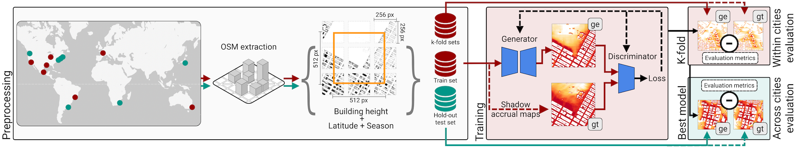

# Deep Umbra: A Generative Approach for Sunlight Access Computation in Urban Spaces

URL: http://evl.uic.edu/shadows/

Deep Umbra is a a novel computational framework that enables the quantification of sunlight access and shadows at a global scale. Our framework is based on a generative adversarial network that considers the physical form of cities to compute high-resolution spatial information of accumulated sunlight access for the different seasons of the year. Deep Umbra's primary motivation is the impact that shadow management can have in people's quality of live, since it can affect levels of comfort, heat distribution, public parks, etc.

We also present the Global Shadow Dataset, a comprehensive dataset with the accumulated shadow information for over 100 cities in 6 continents. In order to visualize the data, click [here](http://evl.uic.edu/shadows/map/). To download the data, click [here](http://evl.uic.edu/shadows/).

### How good is the Global Shadow Dataset?

Our metrics show that RMSE for the generated tiles in the global shadow dataset is fairly low at 0.063, which in practical terms means that, when accumulating 360 minutes for the winter season, the error would be equal to 23 minutes.

#### Evaluation metrics

To evaluate our framework, we performed experiments considering a large set of cities, taking into account different continents and building morphologies. We evaluated the model on seven cities across four different continents (within cities). Next, we test the transferability of our trained model to cities outside the initial training set (across cities). We report per-pixel rootmean-square error (RMSE), mean absolute error (MAE) and mean squared error (MSE) and structural similarity (SSIM) in both evaluations, considering ground truth tiles as a reference to the generated accumulated shadow tiles. For SSIM, higher values are better.

Within cities performance analysis:

|                |  RMSE   |   MAE   |   MSE   |   SSIM   |
| -------------- | :-----: | :-----: | :-----: |  :-----: |
| K-fold (k = 5) | 0.0631  | 0.0276  | 0.0063  |  0.9000  |

Across cities performance analysis:

| Target city   |    RMSE    |     MAE    |     MSE    |     SSIM    |
| ------------- | :---------:| :---------:| :---------:| :---------: |
| Washington DC |   0.0786   |   0.0786   |   0.0091   |    0.8819   |
| NYC           |   0.0818   |   0.0374   |   0.0084   |    0.8792   |
| Boston        |   0.0743   |   0.0309   |   0.0081   |    0.8985   |
| Seattle       |   0.0597   |   0.0339   |   0.0043   |    0.8578   |
| Johannesburg  |   0.0281   |   0.0102   |   0.0014   |    0.8749   |
| Buenos Aires  |   0.0441   |   0.0146   |   0.0033   |    0.9160   |
| Tokyo         |   0.0837   |   0.0432   |   0.0093   |    0.7981   |
| **Average**   | **0.0643** | **0.0289** | **0.0063** |  **0.8724** |

### Overview

This repository contains the code for the paper "Deep Umbra: A Global-Scale Generative Adversarial Approach for Sunlight Access and Shadow Accumulation in Urban Spaces".

Authors:

Kazi Shahrukh Omar (UIC)

Gustavo Moreira (UFF)

Daniel Hodczak (UIC)

Maryam Hosseini (Rutgers / NYU)

Nicola Colaninno (Polytechnic University of Milan)

Marcos Lage (UFF)

[Fabio Miranda](https://fmiranda.me) (UIC)

**Paper: Arxiv link soon**

## Prerequisites

The code is written in Python. The following Python packages are required:

```
python 3.9.x
tensorflow-gpu 2.8.0
cudatoolkit 11.2.2
cudnn 8.1.0
Pandas 2.0.0
Numpy 1.23.5
Geopandas 0.12.2
OpenCV 4.7.0
pygeos 0.14
pyproj 3.5.0
scikit_learn 1.2.2
osmium 3.6.0
scikit_image
rasterio
```

## Structure

The code is stucture as different Jupyter Notebooks. `01-download-osm-data.ipynb` downloads OpenStreetMap data. A height map is generated with `02-generate-elevation-map`, followed by data preparation in `03-prepare-data.ipynb`, GAN training (`04-GAN-shadow-height-spatial`), evaluation (`05-evaluate-spatial.ipynb`, `06-evaluation-all-cases.ipynb`, `07-evaluation-measurements.ipynb`) and computation of data and performance metrics for multiple cities (`08-compute-cities.ipynb`, `09-compute-urban-metrics.ipynb `, `10-urban-metrics-analysis.ipynb`). Height distribution of training data tiles were inspected in `11-test-height-generalizability` and ablation experiments with different loss functions, generators and attention modules were tested in `12-test-loss-functions`, `13-test-generators-and-attention`, and `14-test-all`. Part of parks case study (what-if experiment) was done in `15-case-study-parks` and image for explanation of padded input image was generated using `16-image_input_padding`.

The weights for our pre-trained model can be downloaded [here](https://drive.google.com/file/d/1DoCpba4L7AlG7ZTvBDXwsLxltLm3ezgH/view?usp=sharing). If you use the weights, you can skip the GAN training and focus on data preparation and inference (remaining steps).
